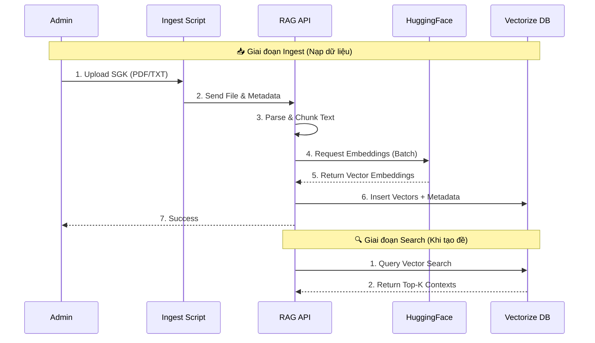
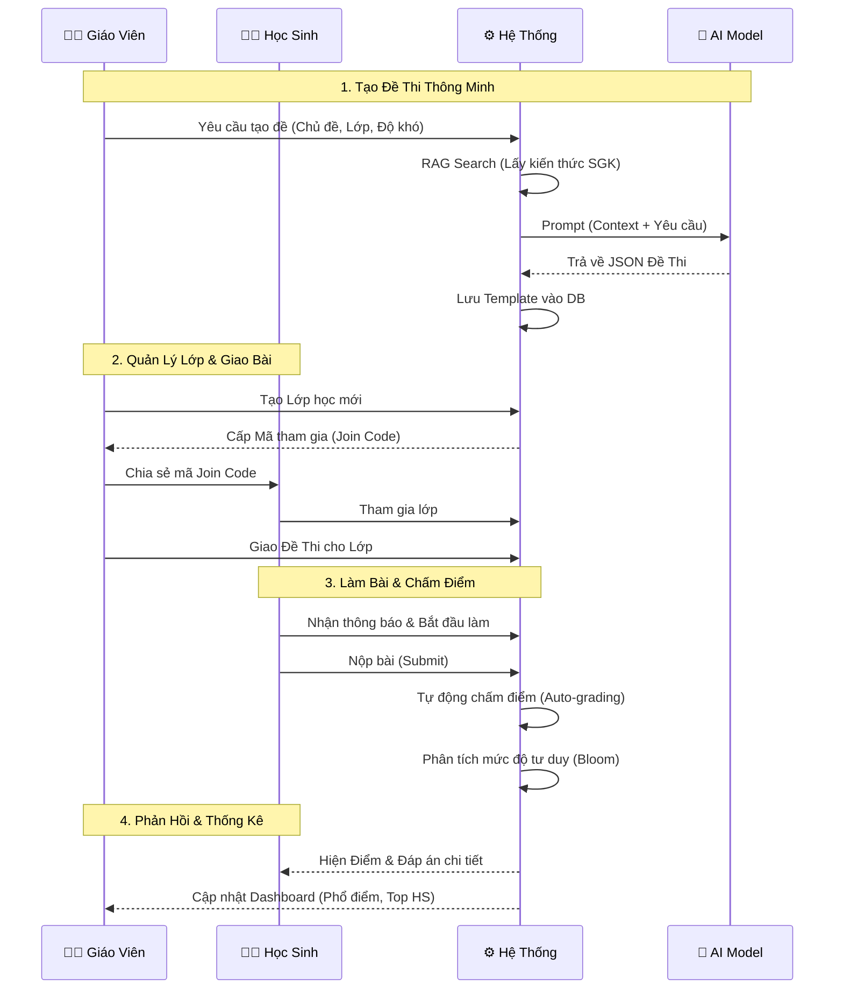
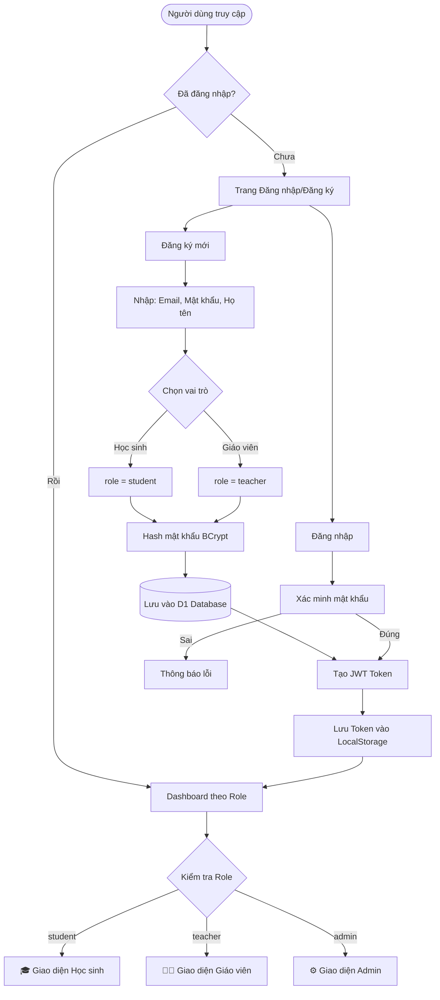
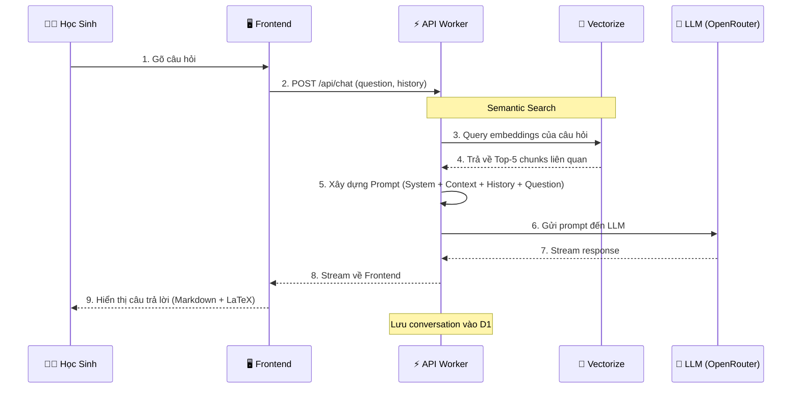
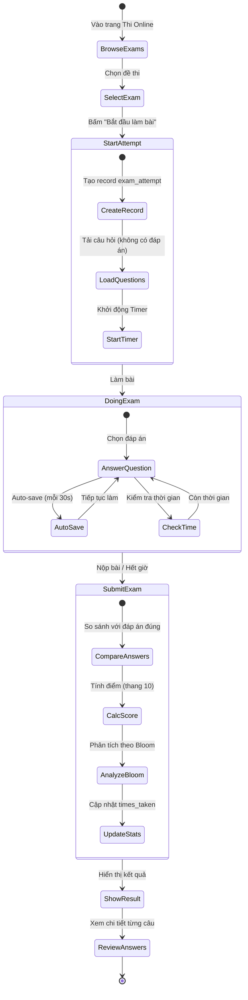
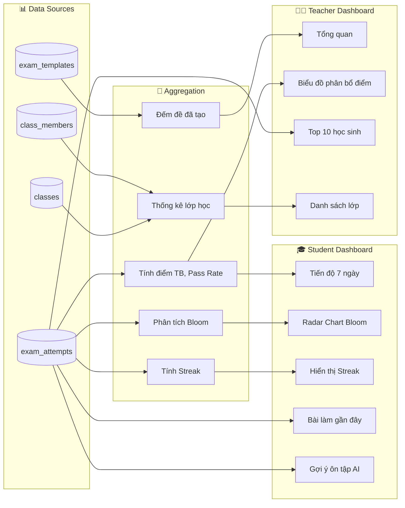
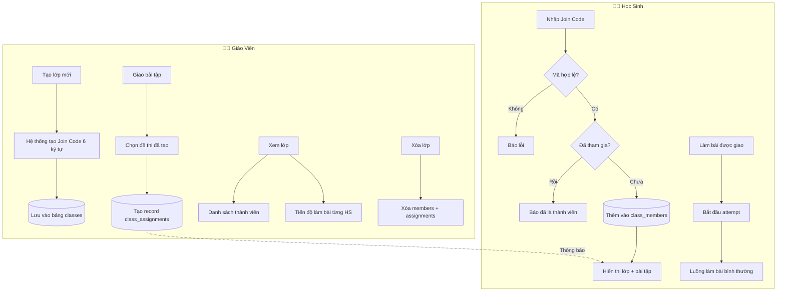

# 🎓 STEM Vietnam v2.0 - Hệ Thống Dạy & Học Thông Minh


> **Dự án Nghiên cứu Khoa học & Chuyển đổi số Giáo dục**
> Nền tảng học tập thông minh tích hợp AI, RAG (Retrieval-Augmented Generation) và Hệ thống quản lý lớp học, hỗ trợ toàn diện môn Công Nghệ THPT.

---

## 🏗️ Kiến Trúc Hệ Thống (System Architecture)

Hệ thống được xây dựng trên nền tảng Serverless hiện đại của Cloudflare, tối ưu chi phí và hiệu năng.

```mermaid
graph TD
    Client[🖥️ Frontend Client\n(React + Vite)] <-->|HTTPS / JWT| Worker[⚡ Cloudflare Worker\n(API Gateway)]
    
    subgraph "Core Services"
        Worker --> Auth[🔐 Auth Service]
        Worker --> Exam[📝 Exam System]
        Worker --> Class[🏫 Class System]
        Worker --> RAG[🧠 RAG Pipeline]
    end

    subgraph "Data Layer"
        Exam & Class --> D1[(🗄️ D1 Database\nSQL Relational)]
        RAG --> Vectorize[(💠 Vectorize\nVector Database)]
        RAG --> R2[(📦 R2 Storage\nFile Storage)]
    end

    subgraph "AI & External"
        RAG -->|Embeddings| HF[🤗 HuggingFace API\n(Sentence Transformers)]
        RAG & Exam -->|Inference| AI[🤖 OpenRouter / Gemini\n(LLM Generation)]
    end
```

---

## 🔄 Quy Trình Xử Lý Logic (Logic Flows)

### 1. Luồng RAG (Retrieval-Augmented Generation)
Quy trình nạp dữ liệu (SGK) và tìm kiếm thông tin cho AI.



### 2. Luồng Hệ Thống Lớp Học & Thi Cử
Kết hợp giữa Giáo viên, Học sinh và AI để tạo nên vòng lặp học tập khép kín.



### 3. Luồng Xác Thực (Authentication Flow)
Quy trình đăng ký, đăng nhập và phân quyền người dùng.



### 4. Luồng Chat AI (RAG-Powered Chat)
Cách hệ thống trả lời câu hỏi của học sinh với ngữ cảnh từ SGK.



### 5. Luồng Làm Bài Thi Chi Tiết (Exam Taking Flow)
Quy trình từ khi bắt đầu làm bài đến khi xem kết quả.



### 6. Luồng Dashboard & Thống Kê
Cách dữ liệu được tổng hợp để hiển thị trên Dashboard.



### 7. Luồng Quản Lý Lớp Học (Class Management)
Chi tiết các thao tác trong hệ thống lớp học.



---

## ✨ Tính Năng Chi Tiết

### 1. 🔐 Hệ Thống Phân Quyền (RBAC)
*   **Học Sinh:**
    *   Dashboard cá nhân: Tiến độ, Streak, Gợi ý ôn tập.
    *   Làm bài thi Online (có đếm giờ, auto-save).
    *   Xem lịch sử bài làm và đáp án chi tiết.
*   **Giáo Viên:**
    *   Dashboard quản lý: Thống kê tổng quan, Biểu đồ phân bổ điểm.
    *   Tạo đề thi bằng AI (nhanh chóng, chính xác nhờ RAG).
    *   Quản lý lớp học và giao bài tập.

### 2. 🧠 RAG System (AI Core)
*   **Real Data:** Chỉ sử dụng dữ liệu từ Sách Giáo Khoa và tài liệu chính thống đã được verified.
*   **Hybrid Search:** Kết hợp tìm kiếm theo ngữ nghĩa (Vector) và từ khóa.
*   **AI Models:** Hỗ trợ linh hoạt Gemini Flash 2.0, GPT-4o-mini qua OpenRouter.

### 3. 🏫 Class System (Lớp Học)
*   Tạo lớp học với mã tham gia duy nhất (6 ký tự).
*   Giao bài tập (Assignments) cho toàn bộ thành viên.
*   Theo dõi trạng thái làm bài của từng học sinh.

---

---

## 📖 Hướng Dẫn Sử Dụng Chi Tiết (User Manual)

### 👨‍🏫 Dành Cho Giáo Viên (Teacher)

#### 1. Quản Lý Dashboard
*   Truy cập **"📊 Dashboard GV"** để xem tổng quan.
*   **Chỉ số:** "Tổng số đề thi", "Tổng lượt làm bài", "Điểm trung bình" của học sinh.
*   **Biểu đồ:** Xem phân bổ điểm (0-2, 2-4, ..., 8-10) để đánh giá chất lượng đề thi.
*   **Top Học Sinh:** Xem danh sách 10 học sinh có điểm cao nhất.

#### 2. Tạo Đề Thi Thông Minh (AI)
1.  Vào menu **"Tạo Câu Hỏi"**.
2.  Chọn tab **"Tạo đề bằng AI"**.
3.  Điền thông tin:
    *   **Khối:** 10, 11, hoặc 12.
    *   **Phân môn:** Công nghiệp hoặc Nông nghiệp.
    *   **Loại đề:** 15 phút, Giữa kỳ, Cuối kỳ (hệ thống tự chỉnh số câu).
    *   **Độ khó:** Dễ, Trung bình, Khó.
    *   **Chủ đề/Chương:** Nhập tên bài học (VD: "Mạch điện xoay chiều").
4.  Bấm **"Tạo đề thi"**. Hệ thống sẽ tìm kiến thức trong SGK và sinh câu hỏi.
5.  **Quan trọng:** Review lại từng câu hỏi -> Bấm **"Lưu đề thi"**.

#### 3. Quản Lý Lớp Học
*   **Tạo Lớp:** Vào menu **"Lớp Học"** -> Bấm "+ Tạo Lớp Mới" -> Nhập tên & mô tả.
*   **Mã Join Code:** Sau khi tạo, copy mã 6 ký tự (VD: `X7Y9Z2`) gửi cho học sinh.
*   **Giao Bài:**
    1.  Vào chi tiết lớp -> Chọn tab **"Bài Tập"**.
    2.  Bấm "+ Giao Bài Tập".
    3.  Chọn đề thi từ danh sách đã tạo.
    4.  Học sinh trong lớp sẽ thấy bài tập này ngay lập tức.

---

### 👨‍🎓 Dành Cho Học Sinh (Student)

#### 1. Theo Dõi Tiến Độ
*   Truy cập **"📈 Tiến Độ"**.
*   Xem biểu đồ điểm số 7 ngày gần đây.
*   **Radar Chart:** Xem kỹ năng tư duy (Nhận biết, Thông hiểu...).
*   **Gợi ý:** Hệ thống tự động đề xuất bài học cần ôn tập dựa trên câu sai.

#### 2. Tham Gia Lớp Học & Làm Bài
1.  Vào menu **"Lớp Học"**.
2.  Bấm **"Tham Gia Lớp"** -> Nhập mã Code giáo viên cung cấp.
3.  Vào chi tiết lớp, tab **"Bài Tập"** sẽ hiện danh sách bài được giao.
4.  Bấm **"Làm bài ngay"** (hoặc xem điểm nếu đã làm).

#### 3. Thi Online & Tự Luyện
*   Vào menu **"🔥 Thi Online"**.
*   Chọn một đề thi công khai bất kỳ.
*   **Giao diện thi:**
    *   Đồng hồ đếm ngược (tự nộp khi hết giờ).
    *   Danh sách câu hỏi bên phải để chuyển nhanh.
    *   Hệ thống **Auto-save** sau mỗi câu trả lời.
*   **Nộp bài:** Xem ngay điểm số, thời gian làm bài, và đáp án chi tiết.

#### 4. Chat AI Gia Sư
*   Vào menu **"Chat AI"**.
*   Hỏi bất kỳ kiến thức nào (VD: "Giải thích định luật Ohm").
*   AI sẽ tìm trong SGK và trả lời kèm trích dẫn (nếu có).

---

## 🛠️ Cài Đặt & Triển Khai (Setup)

### 1. Yêu Cầu
*   Node.js 18+
*   Cloudflare Account (Free plan OK)

### 2. Cài Đặt Dependencies
```bash
npm install
```

### 3. Cấu Hình Môi Trường
Tạo file `.dev.vars` trong thư mục `workers/`:
```ini
AI_API_KEY=your_key
HF_API_TOKEN=your_huggingface_token
JWT_SECRET=your_secret
```

### 4. Chạy Local
```bash
# Chạy Backend (Worker)
cd workers
npx wrangler dev

# Chạy Frontend (Vite)
npm run dev
```

### 5. Nạp Dữ Liệu RAG (Ingest)
Copy file SGK (PDF/TXT) vào thư mục `data/` và chạy:
```powershell
./scripts/run-ingest.ps1
```

---

## 📂 Cấu Trúc Dự Án

```
stem-vietnam-v2/
├── 📂 data/                 # Thư mục chứa tài liệu để Ingest RAG
├── 📂 scripts/              # Scripts tiện ích (Ingest, Versioning)
├── 📂 src/                  # Frontend Source
│   ├── 📂 components/       # Reusable UI Components
│   ├── 📂 pages/            # Page Views (Exam, Dashboard, Classes...)
│   ├── 📂 lib/              # API Clients & Utilities
│   └── 📂 stores/           # State Management (Zustand)
├── 📂 workers/              # Backend Source (Cloudflare Workers)
│   ├── 📂 migrations/       # D1 SQL Migrations
│   ├── 📂 src/              # Worker Logic
│   │   ├── index.ts         # Main Router
│   │   ├── exam-online-routes.ts # Xử lý thi cử
│   │   ├── class-routes.ts  # Xử lý lớp học
│   │   ├── rag-pipeline.ts  # Logic RAG & Vector Search
│   │   └── ingest.ts        # Xử lý upload file
│   └── wrangler.toml        # Cloudflare Config
└── package.json
```

---
© 2026 STEM Vietnam Project. All rights reserved.
